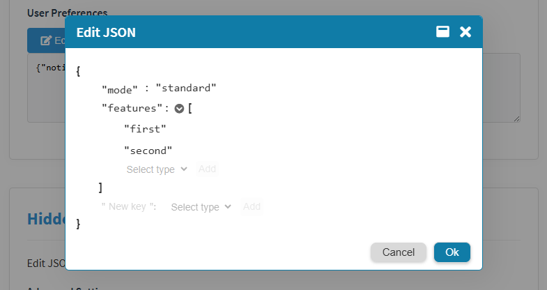
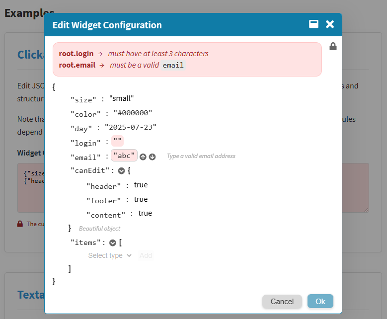
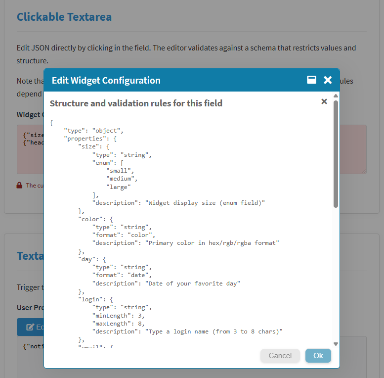
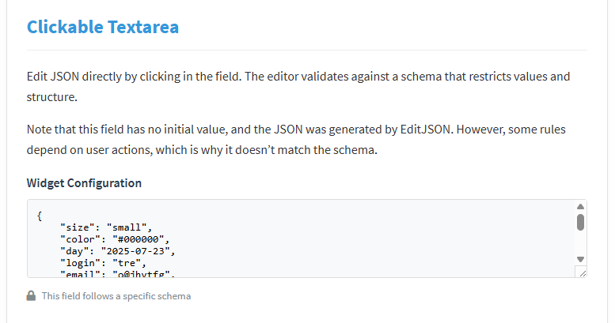
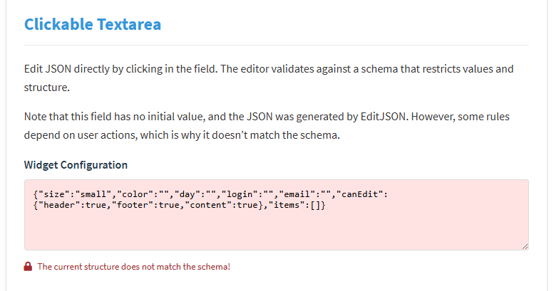
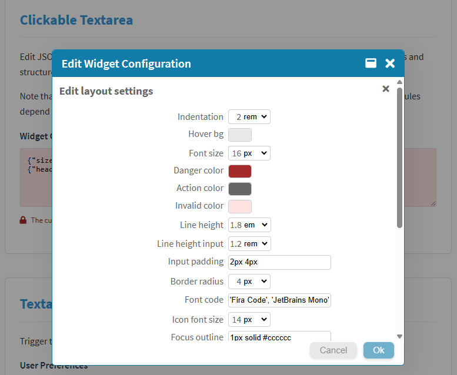

      

# EditJSON
**EditJSON** is a JavaScript component that provides a visual editing interface in a popup, separate from the form field. Designed for use with HTML forms, this module enables clean and safe editing of JSON objects without requiring technical knowledge.

When used alongside a schema in the [JSON Schema](https://json-schema.org/) format, it can truly streamline your workflow by removing the need to create endless interfaces and abstractions just because users can't edit JSON directly. A schema defines what can or cannot be changed and sets clear boundaries for what’s allowed.

## Table of Contents
- [Highlights](#highlights)
- [How to use](#how-to-use)
- [Customization](#customization)
- [Customizing the Editor Layout](#customizing-the-editor-layout)
- [JSON Schema Support](#json-schema-support)
- [License](#license)

## Highlights

-   **Dynamic item manipulation**: Add, remove, and reorder items
-   **Type-specific inputs**: Ensures consistency and prevents users from changing the data type (boolean, number, string)
-   **Date/time inputs**: For time-related values, the input type (`date`, `time`, or `datetime-local`) is determined by the JSON Schema or by the content itself
-   **Color Picker**: `color` input for `hex` and `rgb` strings, set via schema or content
-   **Zero Dependencies**: Lightweight implementation in pure vanilla JavaScript

## How to use

### Automatic initialization

We designed a simple way to initialize the system when loading a form, with no custom scripts required. Just add a few attributes to the tag of the element you want to use with **EditJSON**.

All elements with the `[data-json-editor]` attribute will be automatically transformed.

Just import the loader (as a module), and it’ll do the rest.

```html
<script type="module" src="js/apply-edit-json.js"></script>
```
This script will:

-   Load the CSS files (`edit-json.css`, `popup.css`)
-   Load the main class, EditJSON
-   Apply the editor to all elements with `data-json-editor`
    

### Example
```html
<textarea data-json-editor rows="6" cols="60">
{
    "active": true,
    "tags": ["example", "demo"]
}
</textarea>
```

### Triggered by another element

You can use another element as the trigger, such as a link or button. Just use the `data-target-selector` attribute to point to the `input`/`textarea` containing the JSON to be edited. In this case, the main attribute must also be placed on the trigger element.

```html
<textarea id="myJson" readonly rows="6" cols="60">
{
    "title": "My config",
    "enabled": false
}
</textarea>

<button data-json-editor data-target-selector="#myJson">Edit JSON</button>
```
In this case, the system won’t automatically apply `readonly`, but we recommend blocking direct editing for `text`/`textarea` fields.

The button will open the popup editor for the `<textarea>`, even if it's read-only.

### Manual initialization

If you prefer to skip the loader and initialize manually, here’s an example:

```html
<script type="module">
    import EditJSON from 'edit-json/js/edit-json.js';

    window.addEventListener('DOMContentLoaded', () => {
        // Apply to all elements with [data-json-editor]
        EditJSON.apply();
        
        // Load a single element without the attribute
        const jsonEl = document.getElementById('json_textarea');
        jsonEl.setAttribute('readonly', true);
        jsonEl.addEventListener('click', () => {
            const editor = new EditJSON(jsonEl);
            editor.openEditor();
        });

        // Using a button to open the editor
        const editor = new EditJSON(document.getElementById('json-textarea'));
        document.getElementById('edit-btn').addEventListener('click', () => {
            editor.openEditor();
        });
    });
</script>
```

## Customization

**EditJSON** provides a few configuration options to change the system’s behavior and appearance.

### Disabling controls

You can disable specific features globally: adding, moving, or removing items in arrays or objects, among others.

```js
const editor = new EditJSON(document.getElementById('json-textarea'));

editor.setConfig({ 
    insertItems: false,    // Disable adding items to arrays/objects
    moveItems: false,      // Prevent reordering array/object items
    editKeys: false,       // Disable editing of object keys
    removeItems: false,    // Prevent item removal in arrays/objects
    viewSchema: false,     // Prevent users from viewing the schema
    viewConfig: true,      // Allow user to edit the layout
    blockIfInvalid: false  // Keep OK button enabled even with errors
});
```

### Changing labels and icons

You can use the static method `Strings.set()` to change labels or icons. To do this, import the `Strings` class as well.

```js
import EditJSON, { Strings } from 'edit-json';

Strings.set({
    popupTitle: 'Edit JSON',
    popupOkButtonLabel: 'Save',
    popupCancelButtonLabel: 'Cancel',
    moveUpIcon: '⬆️',
    moveDownIcon: '⬇️',
    removeIcon: '❌'
});
```
Place this code before calling `EditJSON.apply()` or directly inside the `apply-edit-json.js` loader file, if you’re using it.

To remove Font Awesome, use `Strings.set()` to replace all icons (`lockIcon`, `moveUpIcon`, `moveDownIcon`, `removeIcon`, `collapseItemIcon`, `expandItemIcon`, `closeIcon`, `popupClose`, `popupMaximize`, `popupRestore`, `configIcon`). After that, you can safely remove the dependency.

You can also use `Strings.set()` to translate the interface—but if you want to translate **everything**, there's a better way.

### Full interface translation

To translate all strings, use `/langs/model.json` as a template and name your file using the appropriate language code (e.g., `pt-BR.json`, `es-MX.json`, `ru.json`, etc). You can explicitly load it before your HTML using `Strings.loadLanguage`.

```javascript
Strings.loadLanguage('pt-BR');
```
Otherwise, if the browser's language is available in `/langs`, it will be loaded automatically.

## Customizing the Editor Layout  
The editor's layout uses CSS variables for styling, and we provide a built-in interface for users to customize **colors**, **indentation**, **fonts** and more. A basic CSS knowledge is desirable.

### How to Enable  
By default, the customization controls are hidden. To display them:  
```javascript
const editor = new EditJSON(element);
editor.setConfig({ viewConfig: true }); // Shows the layout settings link
```

### Key Notes  
- Requires `edit-json.css` to be loaded. 
- Changes are stored locally in your browser*
- Customizations don't affect validation or functionality.  
- For advanced changes, override the CSS variables directly.  

<sub>* Preferences won't sync across devices/browsers</sub>

## JSON Schema Support

JSON Schema includes a wide range of validation rules. We chose not to use external dependencies, so our local validation doesn’t support **everything**, but we do cover the most important parts.

### Validated rules

These are all validated in real-time while editing:

**Data Types**

-   Numbers, strings, booleans, arrays, and objects

**String Formats**

-   `email`, `date`, `time`, `date-time`, `color` (hex/rgb)

**Specific Values**

-   `enum`: List of allowed values
-   `const`: Exact required value
    

**Size & Limits**

-   Strings: `minLength` / `maxLength`
-   Numbers: `minimum` / `maximum`
-   Arrays: `minItems` / `maxItems`

**Required Fields**

-   `required`: Prevents removal of required fields

**Object Structure**

-   `additionalProperties: false`: Blocks any properties not defined in the schema

### Features

**Auto-generated structure**  
If a field has a defined schema but no initial value, the system creates the structure automatically.

**Type consistency**  
Each data type and format is edited through a specific UI, and users can't change the type. For example, `true` won’t become `"true"`, and `1` won’t become `"1"`.

**Editing restrictions**  
Certain UI controls may be hidden to enforce schema rules. For instance, an object with `additionalProperties` won’t show the “add” button, and required fields won’t have a “remove” option.

**Live validation**  
Validation is run after every change, with real-time error feedback—making it easy to understand what needs fixing.

**Editing help**  
The schema can optionally be shown to the user (in raw JSON format).  
Descriptions in the schema (`description` fields) appear as tooltips or inline hints.

### Example implementation

1.  **Register the schema globally** (before loading EditJSON):

```javascript
window.EditJSONSchemas = {
    metadata: {
        type: "object",
        properties: {
            size: {
                type: "string",
                enum: ["small", "medium", "large"],
                description: "Controls widget display dimensions"
            },
            color: {
                type: "string",
                format: "color",
                description: "Primary color (hex/rgb/rgba)"
            }
        }
    }
};
```
2.  **Set it on the HTML element**:
```html
<!-- data-schema="metadata" links to the global schema -->
<textarea 
    id="config-editor"
    data-json-editor
    data-schema="metadata"
></textarea>
```

## Screenshots

Editor interface


JSON Schema errors / field description


Display JSON Schema


Style form field compilant to schema


Style form field non compilant to schema


Editor layout customization panel


## License

MIT © Cau Guanabara

### License Terms

-   Free to use, modify, and distribute
-   Commercial use allowed
-   Please credit me if you use this component!

----------
> EditJSON by Cau Guanabara (github.com/caugbr)
