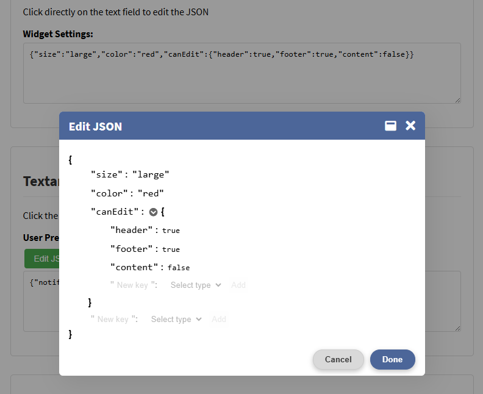
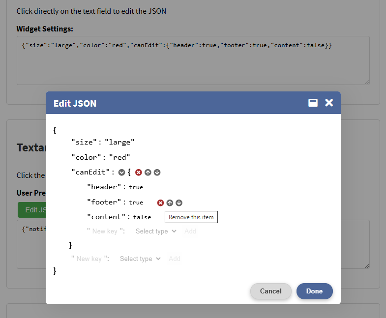
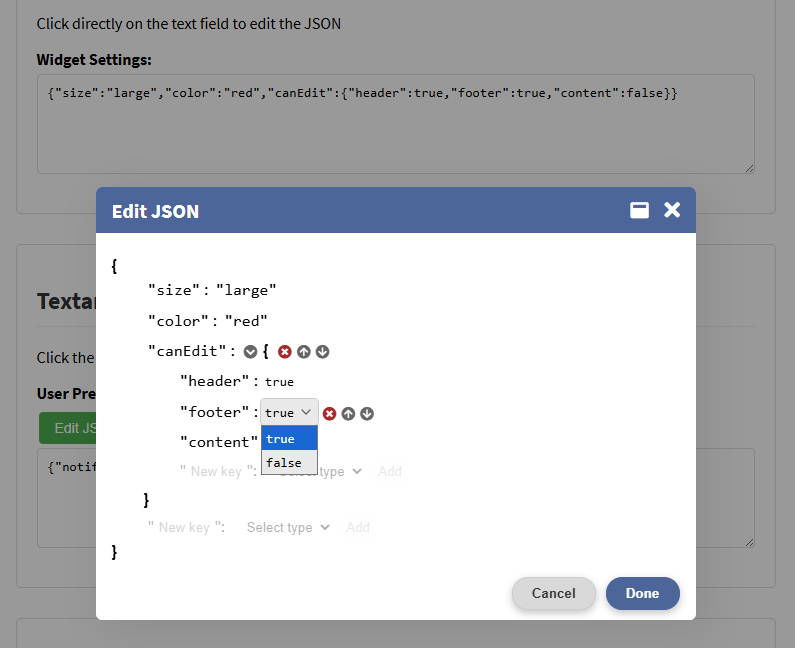
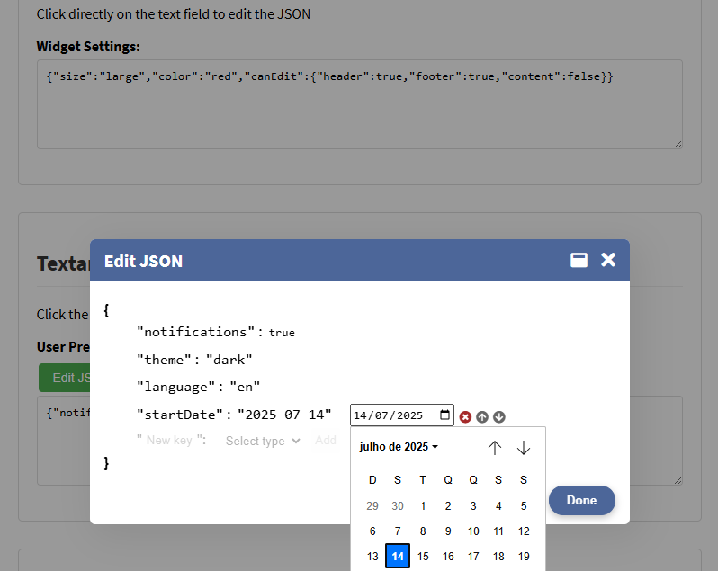
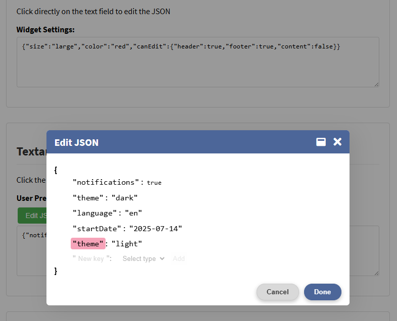

# EditJSON

**EditJSON** is a lightweight JavaScript module that provides a visual JSON editing interface via popup. Designed for admin panels and configuration forms, it enables safe modification of JSON data without requiring technical expertise.

## Highlights

-   **Dynamic item manipulation**: Add, remove, and reorder items
-   **Type-Smart Inputs**: Automatic input selection for each data type (boolean, number, string)
-   **Date/Time Helpers**: Built-in `date`/`time`/`datetime-local` inputs for temporal values
-   **Color Picker**: Integrated `color` input for hex values
-   **Zero Dependencies**: Lightweight vanilla JS implementation

## Usage

### Automatic Initialization

For all elements with `[data-json-editor]` attribute:

```html
<script type="module" src="js/apply-edit-json.js"></script>
```

This loader script will:

-   Load the required CSS (`edit-json.css`, `popup.css`)
-   Attach the editor to all elements with `data-json-editor`

### Manual Initialization

For custom implementation:

```html
<script type="module">
    import EditJSON from 'edit-json/js/edit-json.js';

    window.addEventListener('DOMContentLoaded', () => {
        // Load for elements with the attribute [data-json-editor] set
        EditJSON.apply();
        
        // Load for a single element without the attribute
        const jsonEl = document.getElementById('json_textarea');
        jsonEl.setAttribute('readonly', true);
        jsonEl.addEventListener('click', () => {
            const editor = new EditJSON(jsonEl);
            editor.openEditor();
        });

        // Using a button to open the editor
        const editor = new EditJSON(document.getElementById('json-textarea'));
        document.getElementById('edit-btn').addEventListener('click', () => {
            editor.openEditor();
        });
    });
</script>
```

### Basic Example

```html
<textarea data-json-editor rows="6" cols="60">
{
    "active": true,
    "tags": ["example", "demo"]
}
</textarea>
```

### Trigger Another Element

You can use a separate trigger (like a button) and target the JSON field using `data-target-selector`.

```html
<textarea id="myJson" readonly rows="6" cols="60">
{
    "title": "My config",
    "enabled": false
}
</textarea>

<button data-json-editor data-target-selector="#myJson">Edit JSON</button>
```

The button will open the popup editor for the `<textarea>`, even though it’s read-only.

## Customization

EditJSON provides simple ways to change behavior and appearance.

### Disable Controls

You can globally disable the ability to insert, move or remove items, separatedly. Besides that, you can block the edition of object keys.

```js
const editor =  new  EditJSON(document.getElementById('json-textarea')); 
// Do this before call openEditor()
const insertItems = false; // Disables the insertion of new items in arrays/objects
const moveItems = false; // Locks item positions in arrays/objects
const editKeys = false; // Prevents modification of object property names
const removeItems = false;  // Removes item deletion capabilities
editor.setConfig({ insertItems, moveItems, editKeys, removeItems });
```

This disables the up/down arrows and remove buttons from the editor UI.

### Change Texts or Icons

All interface labels and icons are stored in `Strings` object. You can replace them using the `Strings.set()` static method. You'll need to import `Strings` as well.

```js
import EditJSON, { Strings } from 'edit-json';

Strings.set({
    popupTitle: 'Editar JSON',
    popupOkButtonLabel: 'Salvar',
    popupCancelButtonLabel: 'Cancelar',
    moveUpIcon: '⬆️',
    moveDownIcon: '⬇️',
    removeIcon: '❌'
});
```
Place this before calling `EditJSON.apply()` — or directly inside `apply-edit-json.js` if you're using the default loader.

This also allows you to tanslate all UI strings and replace Font Awesome icons with emojis, plain text, or your own HTML.

No need for Font Awesome unless you want to use it. All visual elements (including the Font Awesome icons) are fully customizable via strings. To do this you must replace all icons (`lockIcon`, `moveUpIcon`, `moveDownIcon`, `removeIcon`, `collapseItemIcon` e `expandItemIcon`).

## JSON Schema Support

EditJSON provides built-in JSON Schema integration to validate and guide JSON editing. When a schema is specified:

### Key Features

**Automatic Structure Generation**  
- Creates valid initial JSON structure when the input field is empty  
- Populates default values for fields defined in the schema  

**Visual Validation**  
- Required fields (`required`) are non-removable  
- Schema-compliant input controls:  
  - `boolean`: True/False dropdown  
  - `date`/`date-time`/`time`: Native date pickers  
  - `color`: Color selector  
  - `enum`: Predefined value dropdown  

**Editing Restrictions**  
- Automatically disables actions when:  
  - Array reaches `minItems`/`maxItems` limits  
  - Object has `additionalProperties: false`  
- 🔒 Icon indicates schema-enforced fields  

**Schema Transparency**  
- View full schema via lock icon  
- Field descriptions appear as helper text  

### Implementation Example

1. **Register Schema Globally** (before loading EditJSON):
```javascript
window.EditJSONSchemas = {
    metadata: {  // Schema identifier
        "type": "object",
        "properties": {
            "size": {
                "type": "string",
                "enum": ["small", "medium", "large"],
                "description": "Controls widget display dimensions"
            },
            "color": {
                "type": "string",
                "format": "color",
                "description": "Primary color (hex/rgb/rgba)"
            }
        }
    }
};
```

2. **Attach to HTML Element**:
```html
<!-- data-schema="metadata" Matches schema key -->
<textarea 
    id="config-editor"
    data-json-editor
    data-schema="metadata"
></textarea>
<!-- If there is a schema, the initial structure is auto-created -->
```

### Current Limitations

- Schema references (`$ref`) not resolved  
- No real-time format validation (`pattern`, `format`)  
- Limited support for composite schemas (`oneOf`/`anyOf`)  

> **Pro Tip**: Use `"additionalProperties": false` to enforce strict structure compliance.

## Screenshots
The editor


Item action links


Editing a boolean value


Editing a string in date format


Duplicated object key


## License

MIT © Cau Guanabara

### License Terms

This project is open source under a **Modified MIT License**

-  Free to use, modify, and distribute
-  Commercial use permitted
-  Credit me if you use this!  

--------
> EditJSON by Cau Guanabara (github.com/caugbr)  
